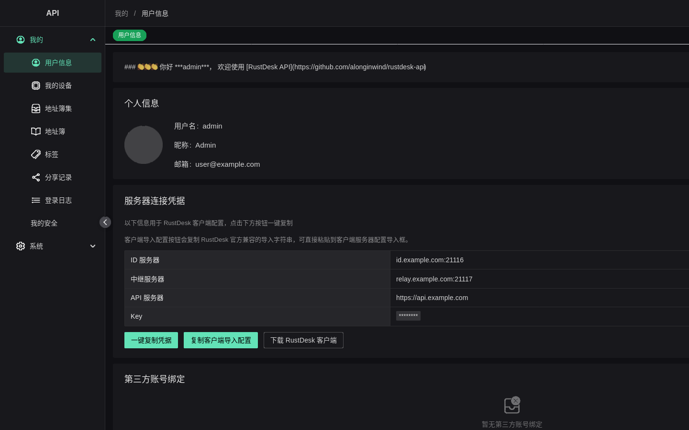
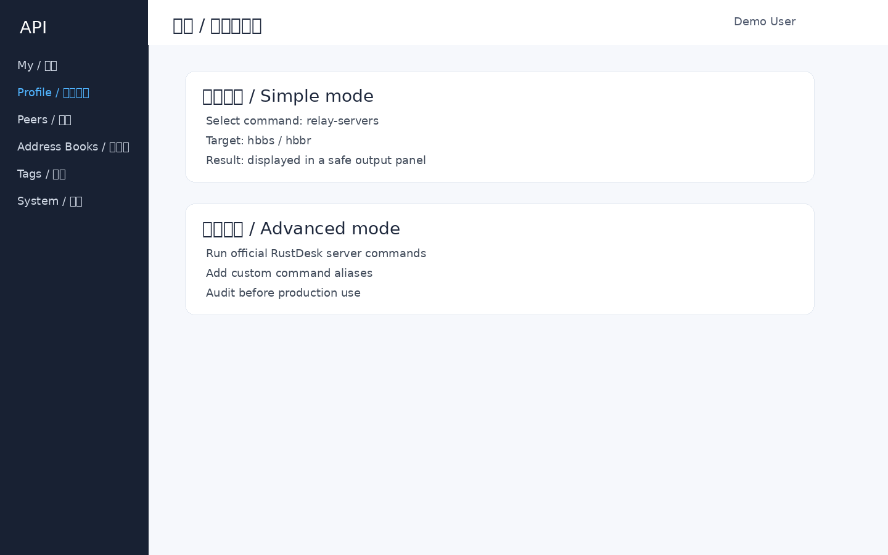
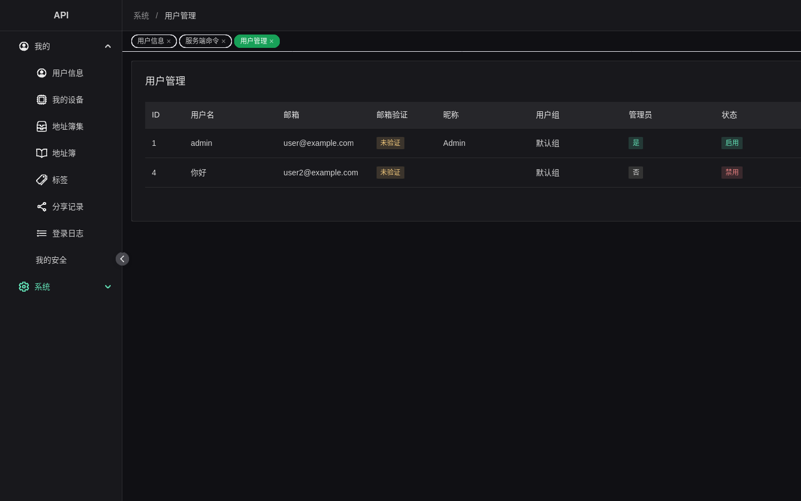
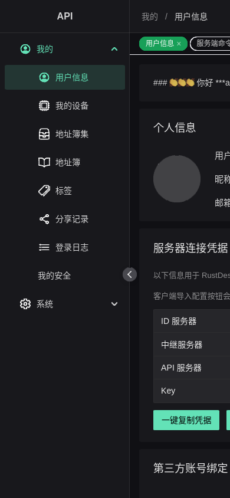

# RustDesk API Web / RustDesk API Web 管理前端

[中文](#中文) · [English](#english)

## 中文

`WeiYusc/rustdesk-api-web` 是 `WeiYusc/rustdesk-api` 的现代 Web Admin 前端，使用 Vue 3、TypeScript、Naive UI、Pinia、Vue Router 和 Vue I18n 构建。

### 界面预览

以下截图来自测试环境并已打码，真实部署时请替换为自己的域名和配置。

| 个人信息与服务器凭据 | 服务端命令 |
| --- | --- |
|  |  |

| 用户管理/系统菜单 | 移动端 |
| --- | --- |
|  |  |

### 功能

- 现代管理界面：Naive UI、暗色模式、响应式布局。
- 多语言：简体中文、繁體中文、English、Français、한국어、Русский、Español。
- 角色菜单：根据后端返回的路由权限自动过滤管理员/普通用户菜单。
- 登录能力：密码登录、验证码、OIDC/OAuth 绑定。
- 我的页面：个人信息、头像上传/裁剪、邮箱、密码、设备、地址簿、标签、分享记录、登录日志。
- 系统管理：用户、Token、群组、设备组、标签、地址簿、OAuth、登录日志、连接/文件审计、分享记录、服务端命令。
- 安全边界：启用 CSP；避免不必要的 `v-html`；Markdown 输出经过清理。


### 管理员文档

- [客户端登录、MUST_LOGIN 与服务器配置排障指南](docs/client-login-and-server-config.zh-CN.md)：说明客户端 API Server / ID Server / Relay Server / Key 配置、`MUST_LOGIN` 启用前检查，以及常见错误矩阵。

### 开发

要求：

- Node.js >= 20
- pnpm（可通过 `corepack enable pnpm` 启用）

```bash
pnpm install
pnpm dev
```

开发服务器默认把 `/api` 代理到：

```text
http://127.0.0.1:21114
```

可用本地 `.env` 覆盖：

```bash
VITE_PROXY_TARGET=http://your-backend:21114
```

### 构建

```bash
pnpm build
```

产物目录：`dist/`。

### 部署到 API 仓库

```bash
# 方式一：同级 rustdesk-api checkout
bash scripts/sync-admin.sh

# 方式二：手动复制
pnpm build
mkdir -p ../rustdesk-api/resources/admin
cp -a dist/. ../rustdesk-api/resources/admin/
```

API 后端会通过 `/_admin/` 提供前端静态资源。

### 被 full-s6 集成镜像消费

`WeiYusc/rustdesk-server` 的 full-s6 构建会把本仓库作为外部输入：

1. 复制当前 checkout 到临时目录。
2. 执行 `pnpm install --frozen-lockfile` 和 `pnpm build`。
3. 把 `dist/` 注入镜像的 `/app/resources/admin`。

当前 full-s6 镜像仍是本地构建/保留方案，尚未发布 Docker Hub/GHCR 公共镜像。

### 验证命令

```bash
pnpm lint:check
pnpm typecheck
pnpm build
git diff --check
```

## English

`WeiYusc/rustdesk-api-web` is the modern Web Admin frontend for `WeiYusc/rustdesk-api`. It is built with Vue 3, TypeScript, Naive UI, Pinia, Vue Router, and Vue I18n.

### UI preview

The screenshots below are captured from a test environment and redacted. Replace the example domains and configuration with your own deployment values.

| Profile and server credentials | Server commands |
| --- | --- |
|  |  |

| System menu | Mobile layout |
| --- | --- |
|  |  |

### Features

- Modern admin UI: Naive UI, dark mode, responsive layout.
- i18n: Simplified Chinese, Traditional Chinese, English, French, Korean, Russian, Spanish.
- Role-based menus: admin/user menus are filtered from backend route permissions.
- Login: password login, captcha, OIDC/OAuth binding.
- My pages: profile, avatar upload/crop, email, password, devices, address books, tags, share records, login logs.
- Admin pages: users, tokens, groups, device groups, tags, address books, OAuth, login logs, connection/file audit logs, share records, server commands.
- Security boundary: CSP enabled; unnecessary `v-html` avoided; Markdown output sanitized.


### Administrator documentation

- [Client Login, MUST_LOGIN, and Server Configuration Troubleshooting Guide](docs/client-login-and-server-config.en.md): explains client API Server / ID Server / Relay Server / Key configuration, checks before enabling `MUST_LOGIN`, and the common error matrix.

### Development

Requirements:

- Node.js >= 20
- pnpm (`corepack enable pnpm` can enable it)

```bash
pnpm install
pnpm dev
```

The dev server proxies `/api` to:

```text
http://127.0.0.1:21114
```

Override with a local `.env` file:

```bash
VITE_PROXY_TARGET=http://your-backend:21114
```

### Build

```bash
pnpm build
```

Output directory: `dist/`.

### Deploy to the API repository

```bash
# Option 1: sibling rustdesk-api checkout
bash scripts/sync-admin.sh

# Option 2: manual copy
pnpm build
mkdir -p ../rustdesk-api/resources/admin
cp -a dist/. ../rustdesk-api/resources/admin/
```

The API backend serves these static assets at `/_admin/`.

### Consumed by the full-s6 integrated image

The `WeiYusc/rustdesk-server` full-s6 build consumes this repository as an external input:

1. Copy this checkout into a temporary directory.
2. Run `pnpm install --frozen-lockfile` and `pnpm build`.
3. Inject `dist/` into the image at `/app/resources/admin`.

The full-s6 image is currently still a local-build/reserved option and has not been published to Docker Hub/GHCR.

### Verification commands

```bash
pnpm lint:check
pnpm typecheck
pnpm build
git diff --check
```
